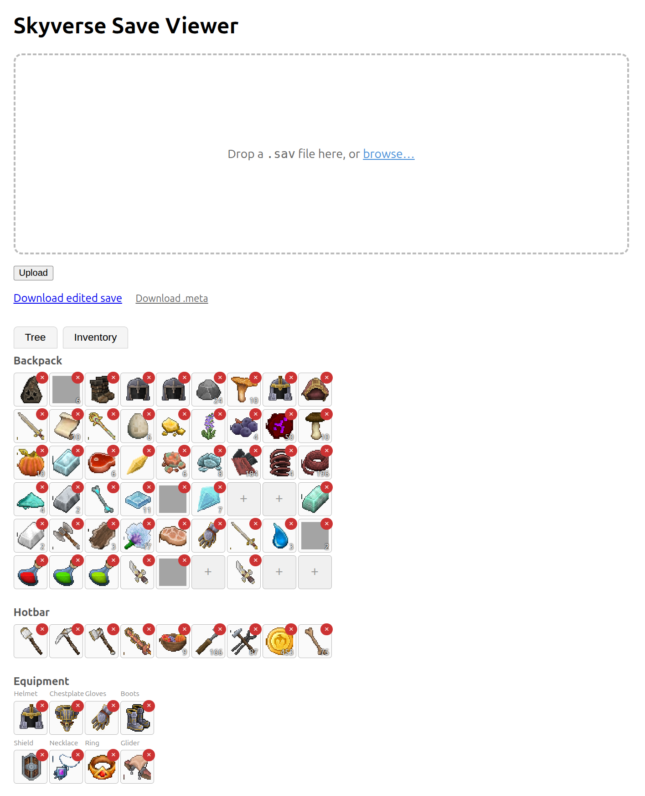
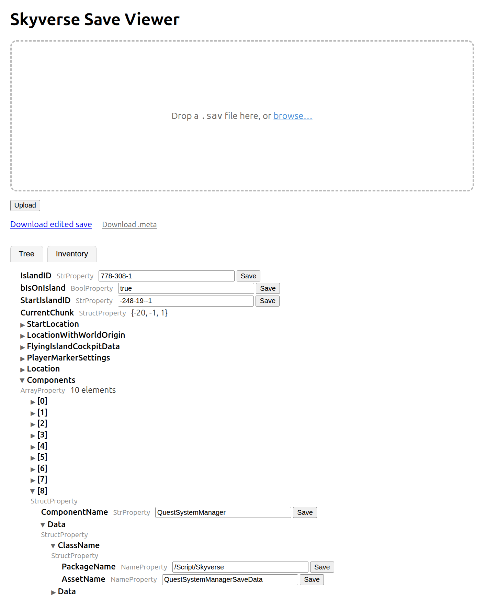
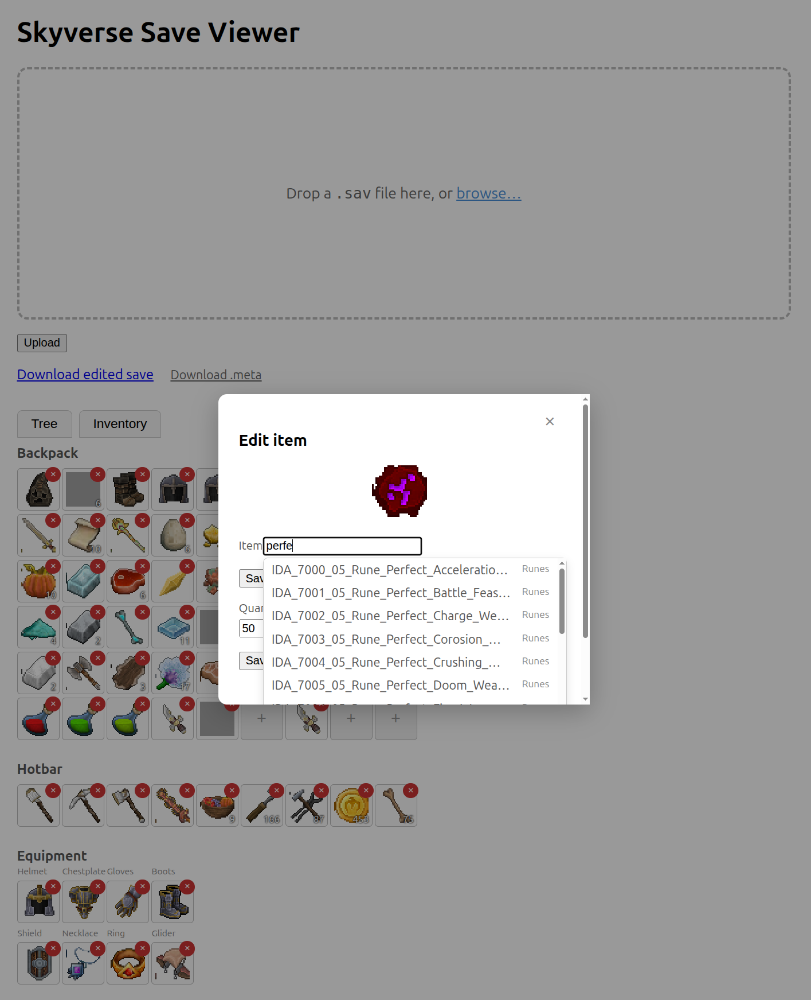

# skyverse-save-web

A standalone web UI for browsing and editing **Skyverse** `.sav` save
files in a browser — no game-file access or command line needed once
it's running. Built on top of the `gvas` library from the sibling
[`Everwind-Save-File-Editor-CLI`](https://github.com/binarybird/Everwind-Save-File-Editor-CLI)
project. See
`docs/superpowers/specs/2026-09-19-skyverse-save-web-design.md` and
`docs/superpowers/specs/2026-09-19-inventory-tab-design.md` for the
design.

## What it does

Upload a `.sav` file and edit it two ways:

- **Tree tab** — the save's entire property tree, lazily expandable.
  Every scalar field (strings, numbers, booleans, item references) is
  editable in place.
- **Inventory tab** — a visual grid that mirrors the game's own
  inventory screen: a 9×6 backpack grid, a 9-slot hotbar row, and an
  8-slot equipment panel (Helmet/Chestplate/Gloves/Boots/Shield/
  Necklace/Ring/Glider), each showing the item's real icon art
  extracted from the game's own assets. Click any slot to edit it.

Download the result as an edited `.sav`, plus the `.meta` checksum
sidecar the game requires to actually accept it (see below) — critical,
easy to miss, and the whole reason that download exists.

## Features

### Searchable item picker

Every place you can set an item — a Tree-tab `ObjectProperty` field or
the Inventory tab's edit/add modal — uses the same searchable picker
instead of making you paste a raw asset path by hand. Start typing and
it filters live (substring match against the item's name, case
insensitive) across the game's full item catalog — over 5,000 entries,
scraped from the installed game's own build manifest, each showing its
name and category so you can tell apart near-duplicates (different
tiers, materials, or variants of the same item). Click a result to fill
in its exact reference; the first 50 matches are shown, so narrowing
your search (e.g. "steel boots" instead of just "boots") helps once
there are a lot of hits.

### Inventory tab

Click any occupied slot to open an edit popup: swap the item (via the
same searchable picker), or change its stack quantity. A small × button
on the slot itself removes the item — with a confirmation prompt first,
since there's no undo. Click an empty slot's + to add an item: search
and pick one, and it's inserted with sensible defaults (or, when an
item of that exact type already exists elsewhere in your save, its
*real* stats/durability/modifiers are cloned instead of guessed — a
"best effort" match, not always the game's own randomized values for
that item).

Icons are real extracted game art (32×32, from the same textures the
game itself uses), not placeholders — about 2,350 of the roughly 5,300
catalog items have one (some, like crafting-recipe entries, correctly
share one generic icon rather than missing one). The rest — mostly
items whose icon uses a compressed texture format this tool doesn't
decode — fall back to a small blank placeholder image rather than a
broken image or raw text.

### Byte-exact editing

Every edit goes through `gvas`, which guarantees anything you *don't*
touch survives Marshal→Unmarshal unchanged — editing one inventory slot
never risks corrupting the rest of the file.

## Build and run

    go build ./...
    ./skyverseweb -addr :8080

Then open http://localhost:8080, upload a `.sav` file (drag-and-drop or
browse), and start editing.

Everything (including the vendored htmx script and every extracted item
icon) is embedded in the binary — no internet access or copy of the
game files is needed at runtime, only to *build* the icon set in the
first place (see `tools/extracticons/README.md`).

### Requirements

This module depends on `skyversesave` via a local `replace` directive in
`go.mod` pointing at wherever `skyverse-save-tool` is checked out on
disk:

    replace skyversesave => /home/binarybird/Desktop/analysis/skyverse-save-tool

If you check out `skyverse-save-tool` at a different path (or on a
different machine), update that line to match.

## Why the `.meta` download matters

Every `<name>.sav` in the game's save directory has a sibling
`<name>.sav.meta` containing nothing but the `.sav` file's CRC32
checksum. **The game recomputes that checksum on load and compares it
against the `.meta` file** — if they don't match, it silently discards
the save and falls back to its own `.backup` instead. No error, no
prompt: your edit just quietly reverts the next time you play.

Since this tool's edited `.sav` never had a real `.meta` written for
it, the game will reject it unless you generate a matching one:

1. Edit your save, then click **"Download edited save"** *and*
   **"Download .meta"** — both downloads keep your original filename
   (e.g. `Player_Local.sav` / `Player_Local.sav.meta`), so they already
   pair up correctly.
2. Copy both files into the game's save directory, overwriting the
   existing pair with the same name.
3. Launch the game — it now sees a checksum match and accepts the edit.

If you ever edit a `.sav` some other way (e.g. `saveview set` from the
CLI tool) instead of through this web UI, regenerate its `.meta` with
`saveview meta` — the exact same checksum format either tool produces
is what the game expects.

## Testing

    go test ./...

Uses the same three real save files as `skyverse-save-tool`'s test
suite (copied into `testdata/`), including full upload → browse → edit
→ download round trips, and (for the Inventory tab) add/remove →
download → re-parse round trips that confirm the resulting file is
still a valid, loadable save.
